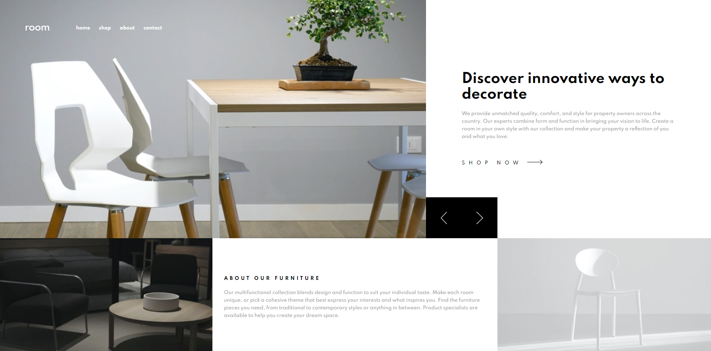

# Frontend Mentor - Room homepage solution

This is a solution to the [Room homepage challenge on Frontend Mentor](https://www.frontendmentor.io/challenges/room-homepage-BtdBY_ENq). Frontend Mentor challenges help you improve your coding skills by building realistic projects.

## Table of contents

- [Overview](#overview)
  - [The challenge](#the-challenge)
  - [Screenshot](#screenshot)
  - [Links](#links)
- [My process](#my-process)
  - [Built with](#built-with)
  - [Continued development](#continued-development)
- [Author](#author)

## Overview

### The challenge

Users should be able to:

- View the optimal layout for the site depending on their device's screen size
- See hover states for all interactive elements on the page
- Navigate the slider using either their mouse/trackpad or keyboard

### Screenshot

### Links

- Solution URL: [Solution](https://github.com/vladan345/daily-furniture-home)
- Live Site URL: [Preview Site](https://vladan345.github.io/daily-furniture-home/)

## My process

### Built with

- Semantic HTML5 markup
- CSS custom properties
- Flexbox
- CSS Grid
- SCSS
- Mobile-first workflow
- JS

### Continued development

Need to make better transition, get that white space fixed on desktop version and add mouse/keyboard/screen swipe functionality to slider

## Author

- Website - [Vladan345](https://github.com/vladan345)
- Frontend Mentor - [@vladan345](https://www.frontendmentor.io/profile/vladan345)
